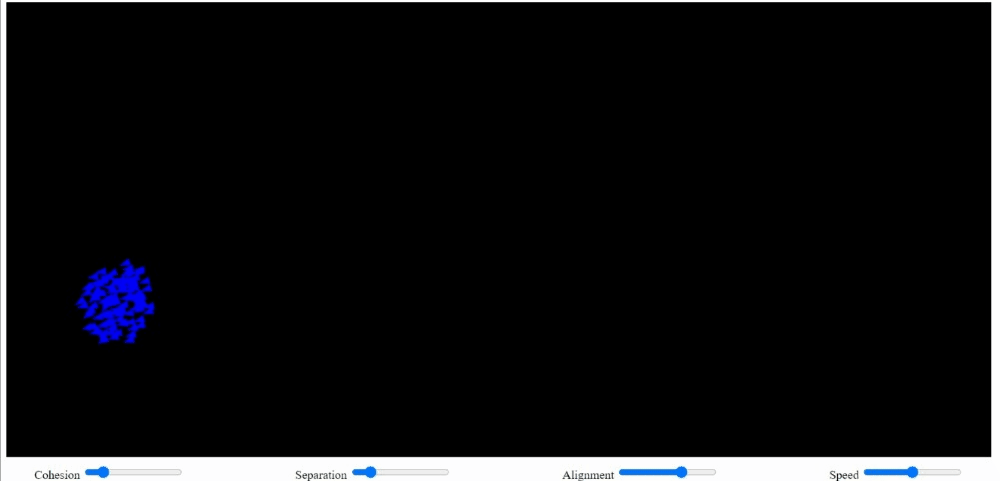

# Boids simulation

This is a simple boids simulation written in TypeScript. It uses the HTML5 canvas element to render the simulation. The simulation is based on [kfish pseudocode](http://www.kfish.org/boids/pseudocode.html).